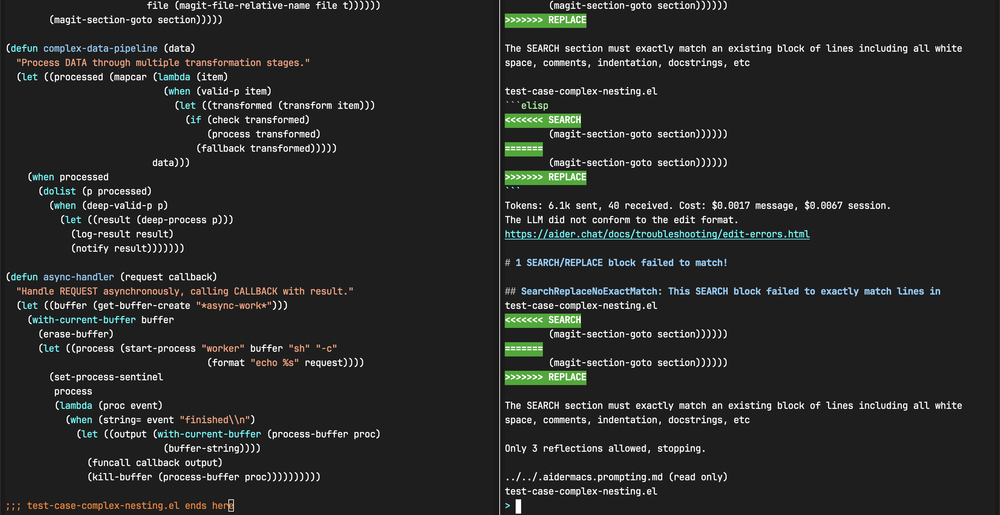
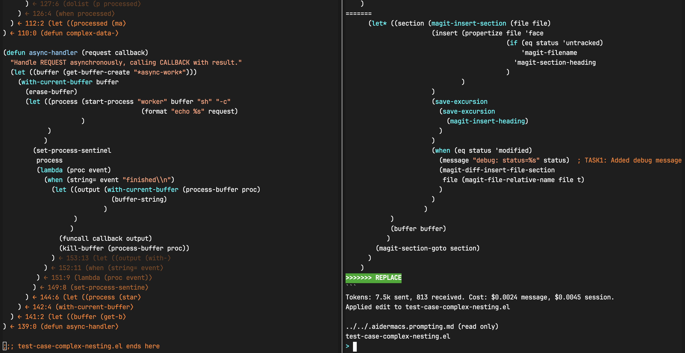

# pearl-paren-style

Toggle Lisp paren style between compact and dangling layouts.

## The Problem in One Picture

| Compact Style (AI Fails)                         | Dangling Style (AI Succeeds)                            |
|:------------------------------------------------:|:-------------------------------------------------------:|
|  |  |
| `Only 3 reflections allowed, stopping`           | `Applied edit successfully`                             |
| **3 retries → gives up**                        | **1 try → clean apply**                                |

Then: `M-x pearl-paren-style-compact` → back to compact, zero git noise.

## The Problem: AI Can't Read Your Mind

AI coding tools (Aider, Copilot, Claude) struggle with Lisp's dense `)))`.

Why? Compact syntax packs multiple nesting levels into single lines. One off-by-one `)` breaks the whole SEARCH/REPLACE block. You manually trace parens. The loop repeats.

## The Insight: Structure Must Be Explicit

Lisp nesting is **implicit** in compact style. Humans read indentation, but AI tools process tokens linearly.

**Two audiences, two representations:**

| Audience  | Needs                               | Format                                 |
|-----------|-------------------------------------|----------------------------------------|
| **Human** | Visual structure, no code pollution | Dangling style + annotations (overlay) |
| **AI**    | Explicit structural hints in text   | Dangling style + comments (permanent)  |

Annotations are for Emacs sessions. Comments are for everywhere else — AI tools, GitHub, code review, documentation.

## The Workflow

<pre>
┌─────────────────┐     ┌─────────────────┐     ┌─────────────────┐
│  Compact code   │────▶│  Dangling style │────▶│  Dangling style │
│  (commit-ready) │     │  + annotations  │     │  + comments     │
└─────────────────┘     └─────────────────┘     │  (AI-readable)  │
         ▲                                      └─────────────────┘
         │                                               │
         │                                               ▼
         │                                      ┌─────────────────┐
         │                                      │  AI generates   │
         │                                      │  (clear blocks) │
         │                                      └─────────────────┘
         │                                               │
         └───────────────────────────────────────────────┘
                      Convert back to compact
</pre>

**Commands:**

1. **Before AI coding**: `M-x pearl-paren-style-dangling`
   - Convert to dangling style
   - Annotations show bracket correspondence (human-readable)

2. **Before AI generation** *(optional)*: `M-x pearl-paren-style-annotations-to-comments`
   - Convert annotations to permanent comments
   - AI tools can read structural hints during generation
   - **Trade-off**: Increases token usage, but further reduces paren matching errors. Skip if AI already handles dangling style well.
   - **Cost control**: Only closing parens at least `pearl-paren-style-annotation-min-distance` lines from their opener are annotated (default: 5). Nearby parens are not annotated, keeping token cost bounded.

3. **AI generation**: Let AI work with separated delimiters (+ visible structure if step 2 used)

4. **Before committing**: `M-x pearl-paren-style-compact`
   - Convert back to compact style
   - Comments are removed, code is clean

**Status**: Unverified. No controlled experiments. Based on:
- General CS principle: explicit structure reduces ambiguity
- Anecdotal reports from early users

**Risk**: Zero. Fully reversible. Try it, see if it helps, ignore if not.

## Installation

### MELPA (Recommended)

Once available on MELPA:

```elisp
M-x package-install RET pearl-paren-style
```

### Manual

Clone and add to load path:

```elisp
(add-to-list 'load-path "/path/to/pearl-paren-style")
(require 'pearl-paren-style)
```

## Usage

### Core Commands

- `M-x pearl-paren-style-toggle`
  Auto-detect current style and toggle between compact and dangling.

- `M-x pearl-paren-style-compact`
  Force compact style (closing parens on same line).

- `M-x pearl-paren-style-dangling`
  Force dangling style (closing parens on separate lines, aligned with openers).
  When `pearl-paren-style-show-annotations` is enabled, displays bracket correspondence.

- `M-x pearl-paren-style-convert`
  Interactive prompt to choose specific style.

### Annotation to Comment (The AI Bridge)

- `M-x pearl-paren-style-annotations-to-comments`
  Convert overlay annotations to permanent comments.
  **Use this before sharing code with AI tools outside Emacs.**

- `M-x pearl-paren-style-comments-to-annotations`
  Convert comments back to interactive overlays.
  **Use this when returning to Emacs editing.**

### Region and File Operations

- `M-x pearl-paren-style-compact-region` / `dangling-region`
  Convert selected region.

- `M-x pearl-paren-style-compact-files` / `dangling-files`
  Convert marked files in Dired or prompted paths.

- `M-x pearl-paren-style-dwim`
  Context-aware: region -> region, Dired -> files, otherwise toggle buffer.

### Testing

- `M-x pearl-paren-style-run-tests`
  Run the full test suite.

## Examples

### Basic Conversion

```elisp
;; Compact (before AI coding)
(defun example ()
  (let ((x 1))
    (when x
      (print x))))

;; Dangling with annotations (during AI editing)
(defun example ()
  (let ((x 1))
    (when x
      (print x)
    ) ← 3:4 (when x⟩
  ) ← 2:2 (let ((x 1))⟩
) ← 1:0 (defun example ()⟩

;; Dangling with comments (for AI tools outside Emacs)
(defun example ()
  (let ((x 1))
    (when x
      (print x)
    )  ;; ← 3:4 (when x⟩
  )  ;; ← 2:2 (let ((x 1))⟩
)  ;; ← 1:0 (defun example ()⟩

;; Compact (after AI coding, commit-ready)
(defun example ()
  (let ((x 1))
    (when x
      (print x))))
```

### Single-line Preservation

Single-line expressions remain unchanged:

```elisp
;; Unchanged in dangling style
(mapcar #'process-item item-list)
(+ 1 2 3)
```

### Comment Handling

Existing comments are preserved during conversion:

```elisp
;; Before
(defun example ()
  (let ((x 1))  ; initialize
    (print x)))  ; output

;; After
(defun example ()
  (let ((x 1))  ; initialize
    (print x)
  )
)  ; output
```

## Configuration

```elisp
;; Default style when ambiguous (default: 'compact)
(setq pearl-paren-style-default 'compact)

;; Enable annotations in dangling style (default: t)
(setq pearl-paren-style-show-annotations t)

;; Minimum distance (in lines) for a closing paren to get an annotation
;; Parens closer than this to their opener are not annotated, reducing token cost
;; when converting annotations to comments for AI tools (default: 5)
(setq pearl-paren-style-annotation-min-distance 5)
```

## License

GPL v3 or later
